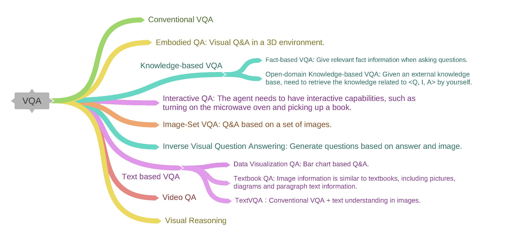

# Awesome-VQA
A reading list of papers about Visual Question Answering.

  

## Table of Contents
  * [Image QA Papers](#image-qa-papers)
     * [Datasets](#datasets)
     * [2021 Papers](#2021-papers)
     * [2020 Papers](#2020-papers)
     * [2019 Papers](#2019-papers)
     * [2018 Papers](#2018-papers)
     * [2017 Papers](#2017-papers)
     * [2016 Papers](#2016-papers)
     * [2015 Papers](#2015-papers)
     * [2014 Papers](#2014-papers)

  * [Embodied QA Papers](#embodied-qa-papers)
  * [Knowledge-based VQA Papers](#knowledge-based-vqa-papers)
     * [Fact-based VQA Papers](#fact-based-vqa-papers)
     * [Open-domain Knowledge-based VQA Papers](#open-domain-knowledge-based-vqa-papers)
  * [Interative QA Papers](#interactive-qa-papers)
  * [Image-Set VQA Papers](#image-set-vqa-papers)
  * [Inverse VQA Papers](#inverse-vqa-papers)
  * [Text-based VQA Papers](#text-based-vqa-papers)
     * [Data Visualization QA Papers](#data-visualization-qa-papers)
     * [Textbook QA Papers](#textbook-qa-papers)
     * [TextVQA Papers](#textvqa-papers)
  * [Visual Reasoning Papers](#visual-reasoning-papers)

  * [Video QA Papers](#video-qa-papers)
     * [Datasets](#datasets-1)
     * [2021 Papers](#2021-papers-1)
     * [2020 Papers](#2020-papers-1)
     * [2019 Papers](#2019-papers-1)
     * [2018 Papers](#2018-papers-1)
     * [2017 Papers](#2017-papers-1)
     * [2016 Papers](#2016-papers-1)
     * [2015 Papers](#2015-papers-1)
     * [2014 Papers](#2014-papers-1)

  

## Image QA Papers
### Datasets
- **GQA** [2019][CVPR] GQA, A New Dataset for Real-World Visual Reasoning and Compositional Question Answering.[[paper](https://openaccess.thecvf.com/content_CVPR_2019/papers/Hudson_GQA_A_New_Dataset_for_Real-World_Visual_Reasoning_and_Compositional_CVPR_2019_paper.pdf)][[dataset](https://cs.stanford.edu/people/dorarad/gqa/evaluate.html)][[中文解读](https://blog.csdn.net/ms961516792/article/details/105073506)]
- **Visual7W** [2016][CVPR] Visual7W: Grounded Question Answering in Images.[[paper](http://openaccess.thecvf.com/content_cvpr_2016/papers/Zhu_Visual7W_Grounded_Question_CVPR_2016_paper.pdf)][[dataset](http://ai.stanford.edu/~yukez/visual7w/)][[中文解读](https://blog.csdn.net/ms961516792/article/details/113609614)]
- **SHAPES** [2016][CVPR] Neural Module Networks.[[paper](http://openaccess.thecvf.com/content_cvpr_2016/papers/Andreas_Neural_Module_Networks_CVPR_2016_paper.pdf)][[dataset](https://github.com/jacobandreas/nmn2)][[中文解读](https://blog.csdn.net/ms961516792/article/details/113535076)]
- **FM-IQA** [2015][NIPS] Are You Talking to a Machine Dataset and Methods for Multilingual Image Question Answering.[[paper](https://arxiv.org/pdf/1505.05612)][[dataset](http://research.baidu.com/Downloads)][[中文解读](https://blog.csdn.net/ms961516792/article/details/113496153)]
- **VQA v1.0** [2015][ICCV] VQA, Visual Question Answering.[[paper](http://openaccess.thecvf.com/content_iccv_2015/papers/Antol_VQA_Visual_Question_ICCV_2015_paper.pdf)][[dataset](https://visualqa.org/)][[中文解读](https://blog.csdn.net/ms961516792/article/details/113420551)]
- **Visual Madlibs** [2015][ICCV] Visual Madlibs Fill in the Blank Description Generation and Question Answering.[[paper](http://openaccess.thecvf.com/content_iccv_2015/papers/Yu_Visual_Madlibs_Fill_ICCV_2015_paper.pdf)][[dataset](http://tamaraberg.com/visualmadlibs/)][[中文解读](https://blog.csdn.net/ms961516792/article/details/113420551)]
- **DAQUAR-Consensus** [2015][ICCV] Ask Your Neurons A Neural-Based Approach to Answering Questions About Images.[[paper](http://openaccess.thecvf.com/content_iccv_2015/papers/Malinowski_Ask_Your_Neurons_ICCV_2015_paper.pdf)][[dataset](https://www.mpi-inf.mpg.de/departments/computer-vision-and-machine-learning/research/vision-and-language/visual-turing-challenge/)][[中文解读](https://blog.csdn.net/ms961516792/article/details/113420551)]
- **DAQUAR** [2014][NIPS] A Multi-World Approach to Question Answering about Real-World Scenes based on Uncertain Input.[[paper](https://arxiv.org/pdf/1410.0210)][[dataset](https://www.mpi-inf.mpg.de/departments/computer-vision-and-machine-learning/research/vision-and-language/visual-turing-challenge/)][[中文解读](https://blog.csdn.net/ms961516792/article/details/113369883)]

### 2021 Papers
- .[[paper]()][[中文解读]()]

### 2020 Papers
- [2020][arXiv] KRISP Integrating Implicit and Symbolic Knowledge for Open-Domain Knowledge-Based VQA.[[paper](https://arxiv.org/pdf/2012.11014)][[中文解读]()]
- [2020][AAAI] Overcoming Language Priors in VQA via Decomposed Linguistic Representations.[[paper](https://ojs.aaai.org/index.php/AAAI/article/view/6776/6630)][[中文解读]()]
- [2020][ACL] Cross-Modality Relevance for Reasoning on Language and Vision.[[paper](https://arxiv.org/pdf/2005.06035)][[中文解读](https://blog.csdn.net/ms961516792/article/details/108254786)]
- [2020][CVPR] Counterfactual Samples Synthesizing for Robust Visual Question Answering.[[paper](https://openaccess.thecvf.com/content_CVPR_2020/papers/Chen_Counterfactual_Samples_Synthesizing_for_Robust_Visual_Question_Answering_CVPR_2020_paper.pdf)][[中文解读]()]
- [2020][CVPR] Counterfactual Vision and Language Learning.[[paper](http://openaccess.thecvf.com/content_CVPR_2020/papers/Abbasnejad_Counterfactual_Vision_and_Language_Learning_CVPR_2020_paper.pdf)][[中文解读]()]
- [2020][CVPR] Fantastic Answers and Where to Find Them Immersive Question-Directed Visual Attention.[[paper](http://openaccess.thecvf.com/content_CVPR_2020/papers/Jiang_Fantastic_Answers_and_Where_to_Find_Them_Immersive_Question-Directed_Visual_CVPR_2020_paper.pdf)][[中文解读]()]
- [2020][CVPR] Hypergraph Attention Networks for Multimodal Learning.[[paper](https://openaccess.thecvf.com/content_CVPR_2020/papers/Kim_Hypergraph_Attention_Networks_for_Multimodal_Learning_CVPR_2020_paper.pdf)][[中文解读]()]
- [2020][CVPR] In Defense of Grid Features for Visual Question Answering.[[paper](http://openaccess.thecvf.com/content_CVPR_2020/papers/Jiang_In_Defense_of_Grid_Features_for_Visual_Question_Answering_CVPR_2020_paper.pdf)][[中文解读]()]
- [2020][CVPR]Multi-Modal Graph Neural Network for Joint Reasoning on Vision and Scene Text.[[paper](http://openaccess.thecvf.com/content_CVPR_2020/papers/Gao_Multi-Modal_Graph_Neural_Network_for_Joint_Reasoning_on_Vision_and_CVPR_2020_paper.pdf)][[中文解读](https://blog.csdn.net/ms961516792/article/details/113843893)]
- [2020][CVPR] On the General Value of Evidence, and Bilingual Scene-Text Visual Question Answering.[[paper](https://openaccess.thecvf.com/content_CVPR_2020/papers/Wang_On_the_General_Value_of_Evidence_and_Bilingual_Scene-Text_Visual_CVPR_2020_paper.pdf)][[中文解读]()]
- [2020][CVPR] SQuINTing at VQA Models, Introspecting VQA Models With Sub-Questions.[[paper](https://openaccess.thecvf.com/content_CVPR_2020/papers/Selvaraju_SQuINTing_at_VQA_Models_Introspecting_VQA_Models_With_Sub-Questions_CVPR_2020_paper.pdf)][[中文解读]()]
- [2020][CVPR] TA-Student VQA, Multi-Agents Training by Self-Questioning.[[paper](http://openaccess.thecvf.com/content_CVPR_2020/papers/Xiong_TA-Student_VQA_Multi-Agents_Training_by_Self-Questioning_CVPR_2020_paper.pdf)][[中文解读]()]
- [2020][CVPR] Towards Causal VQA Revealing and Reducing Spurious Correlations by Invariant and Covariant Semantic Editing.[[paper](http://openaccess.thecvf.com/content_CVPR_2020/papers/Agarwal_Towards_Causal_VQA_Revealing_and_Reducing_Spurious_Correlations_by_Invariant_CVPR_2020_paper.pdf)][[中文解读]()]
- [2020][CVPR] Visual Commonsense R-CNN.[[paper](https://openaccess.thecvf.com/content_CVPR_2020/papers/Wang_Visual_Commonsense_R-CNN_CVPR_2020_paper.pdf)][[中文解读]()]
- [2020][CVPR] VQA with No Questions-Answers Training.[[paper](http://openaccess.thecvf.com/content_CVPR_2020/papers/Vatashsky_VQA_With_No_Questions-Answers_Training_CVPR_2020_paper.pdf)][[中文解读]()]
- [2020][ECCV][oral] A Competence-aware Curriculum for Visual Concepts Learning via Question Answering.[[paper](https://arxiv.org/pdf/2007.01499)][[中文解读]()]
- [2020][ECCV][poster] Interpretable Visual Reasoning via Probabilistic Formulation under Natural Supervision.[[paper](https://www.ecva.net/papers/eccv_2020/papers_ECCV/papers/123540528.pdf)][[中文解读]()]
- [2020][ECCV][poster] Multi-Agent Embodied Question Answering in Interactive Environments.[[paper](https://www.ecva.net/papers/eccv_2020/papers_ECCV/papers/123580647.pdf)][[中文解读]()]
- [2020][ECCV][poster] Reducing Language Biases in Visual Question Answering with Visually-Grounded Question Encoder.[[paper](https://www.ecva.net/papers/eccv_2020/papers_ECCV/papers/123580018.pdf)][[中文解读]()]
- [2020][ECCV][poster] Semantic Equivalent Adversarial Data Augmentation for Visual Question Answering.[[paper](https://www.ecva.net/papers/eccv_2020/papers_ECCV/papers/123640426.pdf)][[中文解读]()]
- [2020][ECCV][poster] TRRNet: Tiered Relation Reasoning for Compositional Visual Question Answering.[[paper](https://www.ecva.net/papers/eccv_2020/papers_ECCV/papers/123660409.pdf)][[中文解读](https://blog.csdn.net/ms961516792/article/details/112299186)]
- [2020][ECCV][poster] Visual Question Answering on Image Sets.[[paper](https://www.ecva.net/papers/eccv_2020/papers_ECCV/papers/123660052.pdf)][[中文解读]()]
- [2020][ECCV][poster] VQA-LOL: Visual Question Answering under the Lens of Logic.[[paper](https://www.ecva.net/papers/eccv_2020/papers_ECCV/papers/123660375.pdf)][[中文解读]()]
- [2020][IJCAI] Mucko, Multi-Layer Cross-Modal Knowledge Reasoning for Fact-based VisualQuestion Answering.[[paper](https://arxiv.org/pdf/2006.09073)][[中文解读]()]
- [2020][NeurIPS] Multimodal Graph Networks for Compositional Generalization in Visual Question Answering.[[paper](https://proceedings.neurips.cc/paper/2020/file/1fd6c4e41e2c6a6b092eb13ee72bce95-Paper.pdf)][[中文解读](https://blog.csdn.net/ms961516792/article/details/113974139)]
- [2020][TMM] Self-Adaptive Neural Module Transformer for Visual Question Answering.[[paper](https://ieeexplore.ieee.org/abstract/document/9095237)][[中文解读]()]

### 2019 Papers
- [2019][AAAI] BLOCK: Bilinear Superdiagonal Fusion for Visual Question Answering and Visual Relationship Detection.[[paper](https://ojs.aaai.org/index.php/AAAI/article/view/4818/4691)][[中文解读]()]
- [2019][AAAI] Lattice CNNs for Matching Based Chinese Question Answering.[[paper](https://ojs.aaai.org/index.php/AAAI/article/download/4633/4511)][[中文解读]()]
- [2019][AAAI] TallyQA Answering Complex Counting Questions.[[paper](https://ojs.aaai.org/index.php/AAAI/article/download/4815/4688)][[中文解读]()]
- [2019][ACMMM] Perceptual Visual Reasoning with Knowledge Propagation.[[paper](https://www.researchgate.net/profile/Xin_Wang274/publication/336710651_Perceptual_Visual_Reasoning_with_Knowledge_Propagation/links/5f4f9ebb299bf13a31978287/Perceptual-Visual-Reasoning-with-Knowledge-Propagation.pdf)][[中文解读]()]
- [2019][CVPR] Cycle-Consistency for Robust Visual Question Answering.[[paper](http://openaccess.thecvf.com/content_CVPR_2019/papers/Shah_Cycle-Consistency_for_Robust_Visual_Question_Answering_CVPR_2019_paper.pdf)][[中文解读]()]
- [2019][CVPR] Embodied Question Answering in Photorealistic Environments with Point Cloud Perception.[[paper](http://openaccess.thecvf.com/content_CVPR_2019/papers/Wijmans_Embodied_Question_Answering_in_Photorealistic_Environments_With_Point_Cloud_Perception_CVPR_2019_paper.pdf)][[中文解读]()]
- [2019][CVPR] Explainable and Explicit Visual Reasoning over Scene Graphs.[[paper](https://openaccess.thecvf.com/content_CVPR_2019/papers/Shi_Explainable_and_Explicit_Visual_Reasoning_Over_Scene_Graphs_CVPR_2019_paper.pdf)][[中文解读]()]
- [2019][CVPR] GQA, A New Dataset for Real-World Visual Reasoning and Compositional Question Answering.[[paper](https://openaccess.thecvf.com/content_CVPR_2019/papers/Hudson_GQA_A_New_Dataset_for_Real-World_Visual_Reasoning_and_Compositional_CVPR_2019_paper.pdf)][[中文解读](https://blog.csdn.net/ms961516792/article/details/105073506)]
- [2019][CVPR] It’s not about the Journey; It’s about the Destination Following Soft Paths under Question-Guidance for Visual Reasoning.[[paper](https://openaccess.thecvf.com/content_CVPR_2019/papers/Haurilet_Its_Not_About_the_Journey_Its_About_the_Destination_Following_CVPR_2019_paper.pdf)][[中文解读]()]
- [2019][CVPR] MUREL, Multimodal Relational Reasoning for Visual Question Answering.[[paper](https://openaccess.thecvf.com/content_CVPR_2019/papers/Cadene_MUREL_Multimodal_Relational_Reasoning_for_Visual_Question_Answering_CVPR_2019_paper.pdf)][[中文解读]()]
- [2019][CVPR] Towards VQA Models That Can Read.[[paper](https://openaccess.thecvf.com/content_CVPR_2019/papers/Singh_Towards_VQA_Models_That_Can_Read_CVPR_2019_paper.pdf)][[中文解读]()]
- [2019][CVPR] Transfer Learning via Unsupervised Task Discovery for Visual Question Answering.[[paper](http://openaccess.thecvf.com/content_CVPR_2019/papers/Noh_Transfer_Learning_via_Unsupervised_Task_Discovery_for_Visual_Question_Answering_CVPR_2019_paper.pdf)][[中文解读]()]
- [2019][CVPR] Visual Question Answering as Reading Comprehension.[[paper](https://openaccess.thecvf.com/content_CVPR_2019/papers/Li_Visual_Question_Answering_as_Reading_Comprehension_CVPR_2019_paper.pdf)][[中文解读]()]
- [2019][ICCV] Compact Trilinear Interaction for Visual Question Answering.[[paper](https://openaccess.thecvf.com/content_ICCV_2019/papers/Do_Compact_Trilinear_Interaction_for_Visual_Question_Answering_ICCV_2019_paper.pdf)][[中文解读]()]
- [2019][ICCV] Language-Conditioned Graph Networks for Relational Reasoning.[[paper](https://openaccess.thecvf.com/content_ICCV_2019/papers/Hu_Language-Conditioned_Graph_Networks_for_Relational_Reasoning_ICCV_2019_paper.pdf)][[中文解读](https://blog.csdn.net/ms961516792/article/details/113843893)]
- [2019][ICCV] Multi-modality Latent Interaction Network for Visual Question Answering.[[paper](https://openaccess.thecvf.com/content_ICCV_2019/papers/Gao_Multi-Modality_Latent_Interaction_Network_for_Visual_Question_Answering_ICCV_2019_paper.pdf)][[中文解读]()]
- [2019][ICCV] Relation-Aware Graph Attention Network for Visual Question Answering.[[paper](http://openaccess.thecvf.com/content_ICCV_2019/papers/Li_Relation-Aware_Graph_Attention_Network_for_Visual_Question_Answering_ICCV_2019_paper.pdf)][[中文解读](https://blog.csdn.net/ms961516792/article/details/113843893)]
- [2019][ICCV] Scene Text Visual Question Answering.[[paper](http://openaccess.thecvf.com/content_ICCV_2019/papers/Biten_Scene_Text_Visual_Question_Answering_ICCV_2019_paper.pdf)][[中文解读]()]
- [2019][ICCV] Taking a HINT Leveraging Explanations to Make Vision and Language Models More Grounded.[[paper](https://openaccess.thecvf.com/content_ICCV_2019/papers/Selvaraju_Taking_a_HINT_Leveraging_Explanations_to_Make_Vision_and_Language_ICCV_2019_paper.pdf)][[中文解读]()]
- [2019][ICCV] U-CAM, Visual Explanation using Uncertainty based Class Activation Maps.[[paper](https://openaccess.thecvf.com/content_ICCV_2019/papers/Patro_U-CAM_Visual_Explanation_Using_Uncertainty_Based_Class_Activation_Maps_ICCV_2019_paper.pdf)][[中文解读]()]
- [2019][ICCV] Why Does a Visual Question Have Different Answers.[[paper](https://openaccess.thecvf.com/content_ICCV_2019/papers/Bhattacharya_Why_Does_a_Visual_Question_Have_Different_Answers_ICCV_2019_paper.pdf)][[中文解读]()]
- [2019][ICLR] THE NEURO-SYMBOLIC CONCEPT LEARNER: INTERPRETING SCENES, WORDS, AND SENTENCES FROM NATURAL SUPERVISION.[[paper](https://arxiv.org/pdf/1904.12584)][[中文解读]()]
- [2019][ICLR] Coarse-grain Fine-grain Coattention Network for Multi-evidence Question Answering.[[paper](https://arxiv.org/pdf/1901.00603)][[中文解读]()]
- [2019][ICLR] Multi-step Retriever-Reader Interaction for Scalable Open-domain Question Answering.[[paper](https://arxiv.org/pdf/1905.05733)][[中文解读]()]
- [2019][ICLR] VISUAL REASONING BY PROGRESSIVE MODULE NETWORKS.[[paper](https://arxiv.org/pdf/1806.02453)][[中文解读]()]
- [2019][ICML] Probabilistic Neural-symbolic Models for Interpretable Visual Question Answering.[[paper](http://proceedings.mlr.press/v97/vedantam19a/vedantam19a.pdf)][[中文解读]()]
- [2019][NeurIPS] Analyzing Compositionality of Visual Question Answering.[[paper]()](not found)[[中文解读]()]
- [2019][NeurIPS] Heterogeneous Graph Learning for Visual Commonsense Reasoning.[[paper](https://arxiv.org/pdf/1910.11475)][[中文解读]()]
- [2019][NeurIPS] Learning by Abstraction The Neural State Machine.[[paper](https://arxiv.org/pdf/1907.03950)][[中文解读]()]
- [2019][NeurIPS] Learning Dynamics of Attention Human Prior for Interpretable Machine Reasoning.[[paper](https://arxiv.org/pdf/1905.11666)][[中文解读]()]
- [2019][NeurIPS] RUBi: Reducing Unimodal Biases in Visual Question Answering.[[paper](https://arxiv.org/pdf/1906.10169)][[中文解读]()]
- [2019][NeurIPS] Self-Critical Reasoning for Robust Visual Question Answering.[[paper](https://arxiv.org/pdf/1905.09998)][[中文解读]()]
- [2019][NeurIPS] Visual Concept-Metaconcept Learning.[[paper](https://arxiv.org/pdf/2002.01464)][[中文解读]()]

### 2018 Papers
- [2018][AAAI] Co-attending Free-form Regions and Detections with Multi-modal Multiplicative Feature Embedding for Visual Question Answering.[[paper](https://ojs.aaai.org/index.php/AAAI/article/download/12240/12099)][[中文解读]()]
- [2018][AAAI] Explicit Reasoning over End-to-End Neural Architectures for Visual Question Answering.[[paper](https://ojs.aaai.org/index.php/AAAI/article/download/11324/11183)][[中文解读]()]
- [2018][AAAI] Exploring Human-like Attention Supervision in Visual Question Answering.[[paper](https://ojs.aaai.org/index.php/AAAI/article/download/12272/12131)][[中文解读]()]
- [2018][AAAI] Movie Question Answering Remembering the Textual Cues for Layered Visual Contents.[[paper](https://ojs.aaai.org/index.php/AAAI/article/download/12253/12112)][[中文解读]()]
- [2018][CVPR] Bottom-Up and Top-Down Attention for Image Captioning and Visual Question Answering.[[paper](https://openaccess.thecvf.com/content_cvpr_2018/papers/Anderson_Bottom-Up_and_Top-Down_CVPR_2018_paper.pdf)][[中文解读]()]
- [2018][CVPR] Cross-Dataset Adaptation for Visual Question Answering.[[paper](http://openaccess.thecvf.com/content_cvpr_2018/papers/Chao_Cross-Dataset_Adaptation_for_CVPR_2018_paper.pdf)][[中文解读]()]
- [2018][CVPR] Customized Image Narrative Generation via Interactive Visual Question Generation and Answering.[[paper](http://openaccess.thecvf.com/content_cvpr_2018/papers/Shin_Customized_Image_Narrative_CVPR_2018_paper.pdf)][[中文解读]()]
- [2018][CVPR] Differential Attention for Visual Question Answering.[[paper](https://openaccess.thecvf.com/content_cvpr_2018/papers/Patro_Differential_Attention_for_CVPR_2018_paper.pdf)][[中文解读]()]
- [2018][CVPR] Don’t Just Assume; Look and Answer Overcoming Priors for Visual Question Answering.[[paper](http://openaccess.thecvf.com/content_cvpr_2018/papers/Agrawal_Dont_Just_Assume_CVPR_2018_paper.pdf)][[中文解读]()]
- [2018][CVPR] DVQA Understanding Data Visualizations via Question Answering.[[paper](https://openaccess.thecvf.com/content_cvpr_2018/papers/Kafle_DVQA_Understanding_Data_CVPR_2018_paper.pdf)][[中文解读]()]
- [2018][CVPR] Embodied Question Answering.[[paper](https://openaccess.thecvf.com/content_cvpr_2018/papers/Das_Embodied_Question_Answering_CVPR_2018_paper.pdf)][[中文解读]()]
- [2018][CVPR] Focal Visual-Text Attention for Visual Question Answering.[[paper](https://openaccess.thecvf.com/content_cvpr_2018/papers/Liang_Focal_Visual-Text_Attention_CVPR_2018_paper.pdf)][[中文解读]()]
- [2018][CVPR] Improved Fusion of Visual and Language Representations by Dense Symmetric Co-Attention for Visual Question Answering.[[paper](http://openaccess.thecvf.com/content_cvpr_2018/papers/Nguyen_Improved_Fusion_of_CVPR_2018_paper.pdf)][[中文解读]()]
- [2018][CVPR] IQA Visual Question Answering in Interactive Environments.[[paper](http://openaccess.thecvf.com/content_cvpr_2018/papers/Gordon_IQA_Visual_Question_CVPR_2018_paper.pdf)][[中文解读]()]
- [2018][CVPR] iVQA Inverse Visual Question Answering.[[paper](http://openaccess.thecvf.com/content_cvpr_2018/papers/Liu_IVQA_Inverse_Visual_CVPR_2018_paper.pdf)][[中文解读]()]
- [2018][CVPR] Learning Answer Embeddings for Visual Question Answering.[[paper](http://openaccess.thecvf.com/content_cvpr_2018/papers/Hu_Learning_Answer_Embeddings_CVPR_2018_paper.pdf)][[中文解读]()]
- [2018][CVPR] Learning by Asking Questions.[[paper](http://openaccess.thecvf.com/content_cvpr_2018/papers/Misra_Learning_by_Asking_CVPR_2018_paper.pdf)][[中文解读]()]
- [2018][CVPR] Learning Visual Knowledge Memory Networks for Visual Question Answering.[[paper](http://openaccess.thecvf.com/content_cvpr_2018/papers/Su_Learning_Visual_Knowledge_CVPR_2018_paper.pdf)][[中文解读]()]
- [2018][CVPR] Multimodal Explanations Justifying Decisions and Pointing to the Evidence.[[paper](http://openaccess.thecvf.com/content_cvpr_2018/papers/Park_Multimodal_Explanations_Justifying_CVPR_2018_paper.pdf)][[中文解读]()]
- [2018][CVPR] Textbook Question Answering under Instructor Guidance with Memory Networks.[[paper](https://openaccess.thecvf.com/content_cvpr_2018/papers/Li_Textbook_Question_Answering_CVPR_2018_paper.pdf)][[中文解读]()]
- [2018][CVPR] Tips and Tricks for Visual Question Answering Learnings from the 2017 Challenge.[[paper](http://openaccess.thecvf.com/content_cvpr_2018/papers/Teney_Tips_and_Tricks_CVPR_2018_paper.pdf)][[中文解读]()]
- [2018][CVPR] Transparency by Design Closing the Gap Between Performance and Interpretability in Visual Reasoning.[[paper](https://openaccess.thecvf.com/content_cvpr_2018/papers/Mascharka_Transparency_by_Design_CVPR_2018_paper.pdf)][[中文解读]()]
- [2018][CVPR] Two can play this Game Visual Dialog with Discriminative Question Generation and Answering.[[paper](https://openaccess.thecvf.com/content_cvpr_2018/papers/Jain_Two_Can_Play_CVPR_2018_paper.pdf)][[中文解读]()]
- [2018][CVPR] Visual Question Answering with Memory-Augmented Networks.[[paper](https://openaccess.thecvf.com/content_cvpr_2018/papers/Ma_Visual_Question_Answering_CVPR_2018_paper.pdf)][[中文解读]()]
- [2018][CVPR] Visual Question Generation as Dual Task of Visual Question Answering.[[paper](http://openaccess.thecvf.com/content_cvpr_2018/papers/Li_Visual_Question_Generation_CVPR_2018_paper.pdf)][[中文解读]()]
- [2018][CVPR] Visual Question Reasoning on General Dependency Tree.[[paper](https://openaccess.thecvf.com/content_cvpr_2018/papers/Cao_Visual_Question_Reasoning_CVPR_2018_paper.pdf)][[中文解读]()]
- [2018][CVPR] VizWiz Grand Challenge Answering Visual Questions from Blind People.[[paper](http://openaccess.thecvf.com/content_cvpr_2018/papers/Gurari_VizWiz_Grand_Challenge_CVPR_2018_paper.pdf)][[中文解读]()]
- [2018][ECCV] A Dataset and Architecture for Visual Reasoning with a Working Memory.[[paper](http://openaccess.thecvf.com/content_ECCV_2018/papers/Guangyu_Robert_Yang_A_dataset_and_ECCV_2018_paper.pdf)][[中文解读]()]
- [2018][ECCV] Deep Attention Neural Tensor Network for Visual Question Answering.[[paper](http://openaccess.thecvf.com/content_ECCV_2018/papers/Yalong_Bai_Deep_Attention_Neural_ECCV_2018_paper.pdf)][[中文解读]()]
- [2018][ECCV] Explainable Neural Computation via Stack Neural Module Networks.[[paper](http://openaccess.thecvf.com/content_ECCV_2018/papers/Ronghang_Hu_Explainable_Neural_Computation_ECCV_2018_paper.pdf)][[中文解读]()]
- [2018][ECCV] Goal-Oriented Visual Question Generation via Intermediate Rewards.[[paper](https://openaccess.thecvf.com/content_ECCV_2018/papers/Junjie_Zhang_Goal-Oriented_Visual_Question_ECCV_2018_paper.pdf)][[中文解读]()]
- [2018][ECCV] Grounding Visual Explanations.[[paper](https://openaccess.thecvf.com/content_ECCV_2018/papers/Lisa_Anne_Hendricks_Grounding_Visual_Explanations_ECCV_2018_paper.pdf)][[中文解读]()]
- [2018][ECCV] Learning Visual Question Answering by Bootstrapping Hard Attention.[[paper](http://openaccess.thecvf.com/content_ECCV_2018/papers/Mateusz_Malinowski_Learning_Visual_Question_ECCV_2018_paper.pdf)][[中文解读]()]
- [2018][ECCV] Question Type Guided Attention in Visual Question Answering.[[paper](http://openaccess.thecvf.com/content_ECCV_2018/papers/Yang_Shi_Question_Type_Guided_ECCV_2018_paper.pdf)][[中文解读]()]
- [2018][ECCV] Question-Guided Hybrid Convolution for Visual Question Answering.[[paper](http://openaccess.thecvf.com/content_ECCV_2018/papers/gao_peng_Question-Guided_Hybrid_Convolution_ECCV_2018_paper.pdf)][[中文解读]()]
- [2018][ECCV] Straight to the Facts Learning Knowledge Base Retrieval for Factual Visual Question Answering.[[paper](https://openaccess.thecvf.com/content_ECCV_2018/papers/Medhini_Gulganjalli_Narasimhan_Straight_to_the_ECCV_2018_paper.pdf)][[中文解读]()]
- [2018][ECCV] Visual Question Answering as a Meta Learning Task.[[paper](http://openaccess.thecvf.com/content_ECCV_2018/papers/Damien_Teney_Visual_Question_Answering_ECCV_2018_paper.pdf)][[中文解读]()]
- [2018][ECCV] Visual Question Generation for Class Acquisition of Unknown Objects.[[paper](https://openaccess.thecvf.com/content_ECCV_2018/papers/Kohei_Uehara_Visual_Question_Generation_ECCV_2018_paper.pdf)][[中文解读]()]
- [2018][ECCV] VQA-E Explaining, Elaborating, and Enhancing Your Answers for Visual Questions.[[paper](https://openaccess.thecvf.com/content_ECCV_2018/papers/Qing_Li_VQA-E_Explaining_Elaborating_ECCV_2018_paper.pdf)][[中文解读]()]
- [2018][ICLR] Compositional Attention Networks for Machine Reasoning.[[paper](https://arxiv.org/pdf/1803.03067)][[中文解读]()]
- [2018][ICLR] INTERPRETABLE COUNTING FOR VISUAL QUESTION ANSWERING.[[paper](https://arxiv.org/pdf/1712.08697)][[中文解读]()]
- [2018][ICLR] LEARNING TO COUNT OBJECTS IN NATURAL IMAGES FOR VISUAL QUESTION ANSWERING.[[paper](https://arxiv.org/pdf/1802.05766)][[中文解读]()]
- [2018][IJCAI] A Question Type Driven Framework to Diversify Visual Question Generation.[[paper](http://www.sdspeople.fudan.edu.cn/zywei/paper/fan-ijcai2018.pdf)][[中文解读]()]
- [2018][IJCAI] Feature Enhancement in Attention for Visual Question Answering.[[paper](https://www.ijcai.org/Proceedings/2018/0586.pdf)][[中文解读]()]
- [2018][IJCAI] From Pixels to Objects Cubic Visual Attention for Visual Question Answering.[[paper](https://www.ijcai.org/Proceedings/2018/0126.pdf)][[中文解读]()]
- [2018][NIPS] Answerer in Questioner’s Mind Information Theoretic Approach to Goal-Oriented Visual Dialog.[[paper](https://arxiv.org/pdf/1802.03881;Answerer)][[中文解读]()]
- [2018][NIPS] Bilinear Attention Networks.[[paper](https://arxiv.org/pdf/1805.07932)][[中文解读]()]
- [2018][NIPS] Chain of Reasoning for Visual Question Answering.[[paper](http://papers.neurips.cc/paper/7311-chain-of-reasoning-for-visual-question-answering.pdf)][[中文解读]()]
- [2018][NIPS] Dialog-to-Action Conversational Question Answering Over a Large-Scale Knowledge Base.[[paper](http://papers.neurips.cc/paper/7558-dialog-to-action-conversational-question-answering-over-a-large-scale-knowledge-base.pdf)][[中文解读]()]
- [2018][NIPS] Learning Conditioned Graph Structures for Interpretable Visual Question Answering.[[paper](https://arxiv.org/pdf/1806.07243)][[中文解读]()]
- [2018][NIPS] Learning to Specialize with Knowledge Distillation for Visual Question Answering.[[paper](http://alinlab.kaist.ac.kr/resource/2018_NIPS_KD_MCL.pdf)][[中文解读]()]
- [2018][NIPS] Neural-Symbolic VQA Disentangling Reasoning from Vision and Language Understanding.[[paper](https://arxiv.org/pdf/1810.02338)][[中文解读]()]
- [2018][NIPS] Out of the Box Reasoning with Graph Convolution Nets for Factual Visual Question Answering.[[paper](https://arxiv.org/pdf/1811.00538)][[中文解读]()]
- [2018][NIPS] Overcoming Language Priors in Visual Question Answering with Adversarial Regularization.[[paper](https://arxiv.org/pdf/1810.03649)][[中文解读]()]

### 2017 Papers
- [2017][CVPR] An Empirical Evaluation of Visual Question Answering for Novel Objects.[[paper](https://openaccess.thecvf.com/content_cvpr_2017/papers/Ramakrishnan_An_Empirical_Evaluation_CVPR_2017_paper.pdf)][[中文解读]()]
- [2017][CVPR] Are You Smarter Than A Sixth Grader Textbook Question Answering for Multimodal Machine Comprehension.[[paper](https://openaccess.thecvf.com/content_cvpr_2017/papers/Kembhavi_Are_You_Smarter_CVPR_2017_paper.pdf)][[中文解读]()]
- [2017][CVPR] CLEVR: A Diagnostic Dataset for Compositional Language and Elementary Visual Reasoning.[[paper](https://openaccess.thecvf.com/content_cvpr_2017/papers/Johnson_CLEVR_A_Diagnostic_CVPR_2017_paper.pdf)][[中文解读]()]
- [2017][CVPR] Creativity Generating Diverse Questions using Variational Autoencoders.[[paper](https://openaccess.thecvf.com/content_cvpr_2017/papers/Jain_Creativity_Generating_Diverse_CVPR_2017_paper.pdf)][[中文解读]()]
- [2017][CVPR] Graph-Structured Representations for Visual Question Answering.[[paper](http://openaccess.thecvf.com/content_cvpr_2017/papers/Teney_Graph-Structured_Representations_for_CVPR_2017_paper.pdf)][[中文解读](https://blog.csdn.net/ms961516792/article/details/113843893)]
- [2017][CVPR] Knowledge Acquisition for Visual Question Answering via Iterative Querying.[[paper](https://openaccess.thecvf.com/content_cvpr_2017/papers/Zhu_Knowledge_Acquisition_for_CVPR_2017_paper.pdf)][[中文解读]()]
- [2017][CVPR] Making the V in VQA Matter Elevating the Role of Image Understanding in Visual Question Answering.[[paper](http://openaccess.thecvf.com/content_cvpr_2017/papers/Goyal_Making_the_v_CVPR_2017_paper.pdf)][[中文解读]()]
- [2017][CVPR] Mining Object Parts from CNNs via Active Question-Answering.[[paper](http://openaccess.thecvf.com/content_cvpr_2017/papers/Zhang_Mining_Object_Parts_CVPR_2017_paper.pdf)][[中文解读]()]
- [2017][CVPR] Multi-level Attention Networks for Visual Question Answering.[[paper](http://openaccess.thecvf.com/content_cvpr_2017/papers/Yu_Multi-Level_Attention_Networks_CVPR_2017_paper.pdf)][[中文解读]()]
- [2017][CVPR] The VQA-Machine Learning How to Use Existing Vision Algorithms to Answer New Questions.[[paper](http://openaccess.thecvf.com/content_cvpr_2017/papers/Wang_The_VQA-Machine_Learning_CVPR_2017_paper.pdf)][[中文解读]()]
- [2017][CVPR] What’s in a Question Using Visual Questions as a Form of Supervision.[[paper](https://openaccess.thecvf.com/content_cvpr_2017/papers/Ganju_Whats_in_a_CVPR_2017_paper.pdf)][[中文解读]()]
- [2017][ICCV] An Analysis of Visual Question Answering Algorithms.[[paper](http://openaccess.thecvf.com/content_ICCV_2017/papers/Kafle_An_Analysis_of_ICCV_2017_paper.pdf)][[中文解读]()]
- [2017][ICCV] Inferring and Executing Programs for Visual Reasoning.[[paper](https://openaccess.thecvf.com/content_ICCV_2017/papers/Johnson_Inferring_and_Executing_ICCV_2017_paper.pdf)][[中文解读]()]
- [2017][ICCV] Learning to Disambiguate by Asking Discriminative Questions.[[paper](http://openaccess.thecvf.com/content_ICCV_2017/papers/Li_Learning_to_Disambiguate_ICCV_2017_paper.pdf)][[中文解读]()]
- [2017][ICCV] Learning to Reason End-to-End Module Networks for Visual Question Answering.[[paper](http://openaccess.thecvf.com/content_ICCV_2017/papers/Hu_Learning_to_Reason_ICCV_2017_paper.pdf)][[中文解读]()]
- [2017][ICCV] Multi-modal Factorized Bilinear Pooling with Co-Attention Learning for Visual Question Answering.[[paper](http://openaccess.thecvf.com/content_ICCV_2017/papers/Yu_Multi-Modal_Factorized_Bilinear_ICCV_2017_paper.pdf)][[中文解读]()]
- [2017][ICCV] MUTAN Multimodal Tucker Fusion for Visual Question Answering.[[paper](http://openaccess.thecvf.com/content_ICCV_2017/papers/Ben-younes_MUTAN_Multimodal_Tucker_ICCV_2017_paper.pdf)][[中文解读]()]
- [2017][ICCV] Structured Attentions for Visual Question Answering.[[paper](http://openaccess.thecvf.com/content_ICCV_2017/papers/Zhu_Structured_Attentions_for_ICCV_2017_paper.pdf)][[中文解读]()]
- [2017][ICCV] VQS Linking Segmentations to Questions and Answers for Supervised Attention in VQA and Question-Focused Semantic Segmentation.[[paper](http://openaccess.thecvf.com/content_ICCV_2017/papers/Gan_VQS_Linking_Segmentations_ICCV_2017_paper.pdf)][[中文解读]()]
- [2017][IJCAI] Automatic Generation of Grounded Visual Questions.[[paper](https://arxiv.org/pdf/1612.06530)][[中文解读]()]
- [2017][IJCAI] Explicit Knowledge-based Reasoning for Visual Question Answering.[[paper](https://arxiv.org/pdf/1511.02570)][[中文解读]()]
- [2017][INLG] Data Augmentation for Visual Question Answering.[[paper](https://www.aclweb.org/anthology/W17-3529.pdf)][[中文解读]()]
- [2017][NIPS] High-Order Attention Models for Visual Question Answering.[[paper](https://arxiv.org/pdf/1711.04323)][[中文解读]()]
- [2017][NIPS] Multimodal Learning and Reasoning for Visual Question Answering.[[paper](http://papers.neurips.cc/paper/6658-multimodal-learning-and-reasoning-for-visual-question-answering.pdf)][[中文解读]()]
- [2017][NIPS] Question Asking as Program Generation.[[paper](https://arxiv.org/pdf/1711.06351)][[中文解读]()]

### 2016 Papers
- [2016][AAAI] Learning to answer questions from image using convolutional neural network.[[paper](https://ojs.aaai.org/index.php/AAAI/article/download/10442/10301)][[中文解读](https://blog.csdn.net/ms961516792/article/details/113496153)]
- [2016][CVPR] Answer-Type Prediction for Visual Question Answering.[[paper](https://www.cv-foundation.org/openaccess/content_cvpr_2016/papers/Kafle_Answer-Type_Prediction_for_CVPR_2016_paper.pdf)][[中文解读](https://blog.csdn.net/ms961516792/article/details/113496153)]
- [2016][CVPR] Ask Me Anything Free-Form Visual Question Answering Based on Knowledge From External Sources.[[paper](https://www.cv-foundation.org/openaccess/content_cvpr_2016/papers/Wu_Ask_Me_Anything_CVPR_2016_paper.pdf)][[中文解读](https://blog.csdn.net/ms961516792/article/details/113496153)]
- [2016][CVPR] Image Question Answering using Convolutional Neural Network with Dynamic Parameter Prediction.[[paper](https://openaccess.thecvf.com/content_cvpr_2016/papers/Noh_Image_Question_Answering_CVPR_2016_paper.pdf)][[中文解读](https://blog.csdn.net/ms961516792/article/details/113535076)]
- [2016][CVPR] Neural Module Networks.[[paper](http://openaccess.thecvf.com/content_cvpr_2016/papers/Andreas_Neural_Module_Networks_CVPR_2016_paper.pdf)][[中文解读](https://blog.csdn.net/ms961516792/article/details/113535076)]
- [2016][CVPR] Stacked Attention Networks for Image Question Answering.[[paper](http://openaccess.thecvf.com/content_cvpr_2016/papers/Yang_Stacked_Attention_Networks_CVPR_2016_paper.pdf)][[中文解读](https://blog.csdn.net/ms961516792/article/details/113609614)]
- [2016][CVPR] Visual7W: Grounded Question Answering in Images.[[paper](http://openaccess.thecvf.com/content_cvpr_2016/papers/Zhu_Visual7W_Grounded_Question_CVPR_2016_paper.pdf)][[中文解读](https://blog.csdn.net/ms961516792/article/details/113609614)]
- [2016][CVPR] Where to Look Focus Regions for Visual Question Answering.[[paper](http://openaccess.thecvf.com/content_cvpr_2016/papers/Shih_Where_to_Look_CVPR_2016_paper.pdf)][[中文解读](https://blog.csdn.net/ms961516792/article/details/113649487)]
- [2016][CVPR] Yin and Yang Balancing and Answering Binary Visual Questions.[[paper](http://openaccess.thecvf.com/content_cvpr_2016/papers/Zhang_Yin_and_Yang_CVPR_2016_paper.pdf)][[中文解读](https://blog.csdn.net/ms961516792/article/details/113649487)]
- [2016][ECCV] Ask, Attend and Answer Exploring Question-Guided Spatial Attention for Visual Question Answering.[[paper](https://arxiv.org/pdf/1511.05234)][[中文解读](https://blog.csdn.net/ms961516792/article/details/113696813)]
- [2016][ECCV] Learning Models for Actions and Person-Object Interactions with Transfer to Question Answering.[[paper](https://arxiv.org/pdf/1604.04808)][[中文解读](https://blog.csdn.net/ms961516792/article/details/113696813)]
- [2016][ECCV] Leveraging Visual Question Answering for Image-Caption Ranking.[[paper](https://arxiv.org/pdf/1605.01379)][[中文解读]()]
- [2016][ECCV] Revisiting Visual Question Answering Baselines.[[paper](https://arxiv.org/pdf/1606.08390)][[中文解读]()]
- [2016][ICML] Dynamic Memory Networks for Visual and Textual Question Answering.[[paper](http://proceedings.mlr.press/v48/xiong16.pdf)][[中文解读]()]
- [2016][NIPS] Hierarchical Question-Image Co-Attention for Visual Question Answering.[[paper](https://arxiv.org/pdf/1606.00061.pdf%20)][[中文解读]()]
- [2016][NIPS] Multimodal Residual Learning for Visual QA.[[paper](https://arxiv.org/pdf/1606.01455)][[中文解读]()]

### 2015 Papers
- [2015][CVPR] VisKE, Visual Knowledge Extraction and Question Answering by Visual Verification of Relation Phrases.[[paper](https://www.cv-foundation.org/openaccess/content_cvpr_2015/papers/Sadeghi_VisKE_Visual_Knowledge_2015_CVPR_paper.pdf)][[中文解读](https://blog.csdn.net/ms961516792/article/details/113369883)]
- [2015][ICCV] Ask Your Neurons A Neural-Based Approach to Answering Questions About Images.[[paper](http://openaccess.thecvf.com/content_iccv_2015/papers/Malinowski_Ask_Your_Neurons_ICCV_2015_paper.pdf)][[中文解读](https://blog.csdn.net/ms961516792/article/details/113420551)]
- [2015][ICCV] Visual Madlibs Fill in the Blank Description Generation and Question Answering.[[paper](http://openaccess.thecvf.com/content_iccv_2015/papers/Yu_Visual_Madlibs_Fill_ICCV_2015_paper.pdf)][[中文解读](https://blog.csdn.net/ms961516792/article/details/113420551)]
- [2015][ICCV] VQA, Visual Question Answering.[[paper](http://openaccess.thecvf.com/content_iccv_2015/papers/Antol_VQA_Visual_Question_ICCV_2015_paper.pdf)][[中文解读](https://blog.csdn.net/ms961516792/article/details/113420551)]
- [2015][NIPS] Are You Talking to a Machine Dataset and Methods for Multilingual Image Question Answering.[[paper](https://arxiv.org/pdf/1505.05612)][[中文解读](https://blog.csdn.net/ms961516792/article/details/113496153)]
- [2015][NIPS] Exploring Models and Data for Image Question Answering.[[paper](https://arxiv.org/pdf/1505.02074)][[中文解读](https://blog.csdn.net/ms961516792/article/details/113496153)]

### 2014 Papers
- [2014][NIPS] A Multi-World Approach to Question Answering about Real-World Scenes based on Uncertain Input.[[paper](https://arxiv.org/pdf/1410.0210)][[中文解读](https://blog.csdn.net/ms961516792/article/details/113369883)]

  

## Embodied QA Papers
- 
  

## Knowledge-based VQA Papers
### Fact-based VQA Papers
- 
### Open-domain Knowledge-based VQA Papers
- 
  

## Interative QA Papers
- 
  

## Image-Set VQA Papers
- 
  

## Inverse VQA Papers
- 
  

## Text-based VQA Papers
### Data Visualization QA Papers
- 
### Textbook QA Papers
- 
### TextVQA Papers
- 
  

## Visual Reasoning Papers
- 
  

## Video QA Papers
### Datasets
- 

### 2021 Papers
- .[[paper]()][[中文解读]()]

### 2020 Papers
- [2020][CVPR] Hierarchical Conditional Relation Networks for Video Question Answering.[[paper](http://openaccess.thecvf.com/content_CVPR_2020/papers/Le_Hierarchical_Conditional_Relation_Networks_for_Video_Question_Answering_CVPR_2020_paper.pdf)][[中文解读]()]
- [2020][CVPR] Modality Shifting Attention Network for Multi-Modal Video Question Answering.[[paper](http://openaccess.thecvf.com/content_CVPR_2020/papers/Kim_Modality_Shifting_Attention_Network_for_Multi-Modal_Video_Question_Answering_CVPR_2020_paper.pdf)][[中文解读]()]
- [2020][ECCV][poster] Knowledge-Based Video Question Answering with Unsupervised Scene Descriptions.[[paper](https://arxiv.org/pdf/2007.08751)][[中文解读]()]
- [2020][TIP] Open-Ended Video Question Answering via Multi-Modal Conditional Adversarial Networks.[[paper](https://ieeexplore.ieee.org/abstract/document/8974594/)][[中文解读]()]
- [2020][WACV] BERT Representations for Video Question Answering.[[paper](http://openaccess.thecvf.com/content_WACV_2020/papers/Yang_BERT_representations_for_Video_Question_Answering_WACV_2020_paper.pdf)][[中文解读]()]

### 2019 Papers
- [2019][AAAI] Beyond RNNs: Positional Self-Attention with Co-Attention for Video Question Answering.[[paper](https://ojs.aaai.org/index.php/AAAI/article/download/4887/4760)][[中文解读]()]
- [2019][AAAI] Structured Two-stream Attention Network for Video Question Answering.[[paper](https://ojs.aaai.org/index.php/AAAI/article/download/4602/4480)][[中文解读]()]
- [2019][ACMMM] Learnable Aggregating Net with Divergent Loss for VideoQA.[[paper](https://dl.acm.org/doi/10.1145/3343031.3350971)][[中文解读]()]
- [2019][ACMMM] Multi-interaction Network with Object Relation for VideoQA.[[paper](https://dl.acm.org/citation.cfm?id=3351065)][[中文解读]()]
- [2019][ACMMM] Question-Aware Tube-Switch Network for VideoQA.[[paper](https://dl.acm.org/citation.cfm?id=3350969)][[中文解读]()]
- [2019][CVPR] Heterogeneous Memory Enhanced Multimodal Attention Model for VideoQA.[[paper](https://openaccess.thecvf.com/content_CVPR_2019/papers/Fan_Heterogeneous_Memory_Enhanced_Multimodal_Attention_Model_for_Video_Question_Answering_CVPR_2019_paper.pdf)][[中文解读]()]
- [2019][CVPR] Progressive Attention Memory Network for Movie Story Question Answering.[[paper](https://openaccess.thecvf.com/content_CVPR_2019/papers/Kim_Progressive_Attention_Memory_Network_for_Movie_Story_Question_Answering_CVPR_2019_paper.pdf)][[中文解读]()]
- [2019][ICCV] SegEQA Video Segmentation based Visual Attention for Embodied Question Answering.[[paper](https://openaccess.thecvf.com/content_ICCV_2019/papers/Luo_SegEQA_Video_Segmentation_Based_Visual_Attention_for_Embodied_Question_Answering_ICCV_2019_paper.pdf)][[中文解读]()]
- [2019][IJCAI] Open-Ended Long-Form Video Question Answering via Hierarchical Convolutional Self-Attention Networks.[[paper](https://arxiv.org/pdf/1906.12158)][[中文解读]()]
- [2019][IJCNN] Gaining Extra Supervision via Multi-task learning for Multi-Modal Video Question Answering.[[paper](https://arxiv.org/pdf/1905.13540)][[中文解读]()]
- [2019][TIP] Compositional Attention Networks With Two-Stream Fusion for Video Question Answering.[[paper](https://ieeexplore.ieee.org/abstract/document/8839734/)][[中文解读]()]
- [2019][TIP] Holistic Multi-modal Memory Network for Movie Question Answering.[[paper](https://arxiv.org/pdf/1811.04595)][[中文解读]()]

### 2018 Papers
- [2018][ACMMM] Explore Multi-Step Reasoning in Video Question Answering.[[paper](https://dl.acm.org/doi/abs/10.1145/3240508.3240563)][[中文解读]()]
- [2018][CVPR] Motion-Appearance Co-Memory Networks for Video Question Answering.[[paper](https://openaccess.thecvf.com/content_cvpr_2018/papers/Gao_Motion-Appearance_Co-Memory_Networks_CVPR_2018_paper.pdf)][[中文解读]()]
- [2018][ECCV] A Joint Sequence Fusion Model for Video Question Answering and Retrieval.[[paper](http://openaccess.thecvf.com/content_ECCV_2018/papers/Youngjae_Yu_A_Joint_Sequence_ECCV_2018_paper.pdf)][[中文解读]()]
- [2018][ECCV] Multimodal Dual Attention Memory for Video Story Question Answering.[[paper](https://openaccess.thecvf.com/content_ECCV_2018/papers/Kyungmin_Kim_Multimodal_Dual_Attention_ECCV_2018_paper.pdf)][[中文解读]()]
- [2018][EMNLP] TVQA, Localized, Compositional Video Question Answering.[[paper](https://arxiv.org/pdf/1809.01696)][[中文解读]()]

### 2017 Papers
- [2017][AAAI] Leveraging Video Descriptions to Learn Video Question Answering.[[paper](https://ojs.aaai.org/index.php/AAAI/article/download/11238/11097)][[中文解读]()]
- [2017][ACMMM] VideoQA via Gradually Refined Attention over Appearance and Motion.[[paper](https://www.comp.nus.edu.sg/~xiangnan/papers/mm17-videoQA.pdf)][[中文解读]()]
- [2017][ACMMM] VideoQA via Hierarchical Dual-Level Attention Network Learning.[[paper](https://dl.acm.org/doi/abs/10.1145/3123266.3123364)][[中文解读]()]
- [2017][CVPR] A Dataset and Exploration of Models for Understanding Video Data Through Fill-In-The-Blank Question-Answering.[[paper](http://openaccess.thecvf.com/content_cvpr_2017/papers/Maharaj_A_Dataset_and_CVPR_2017_paper.pdf)][[中文解读]()]
- [2017][CVPR] End-to-end Concept Word Detection for Video Captioning, Retrieval, and Question Answering.[[paper](http://openaccess.thecvf.com/content_cvpr_2017/papers/Yu_End-To-End_Concept_Word_CVPR_2017_paper.pdf)][[中文解读]()]
- [2017][CVPR] TGIF-QA Toward Spatio-Temporal Reasoning in Visual Question Answering.[[paper](http://openaccess.thecvf.com/content_cvpr_2017/papers/Jang_TGIF-QA_Toward_Spatio-Temporal_CVPR_2017_paper.pdf)][[中文解读]()]
- [2017][ICCV] MarioQA Answering Questions by Watching Gameplay Videos.[[paper](https://openaccess.thecvf.com/content_ICCV_2017/papers/Mun_MarioQA_Answering_Questions_ICCV_2017_paper.pdf)][[中文解读]()]
- [2017][ICCV] Video Fill In the Blank using LRRL LSTMs with Spatial-Temporal Attentions.[[paper](http://openaccess.thecvf.com/content_ICCV_2017/papers/Mazaheri_Video_Fill_in_ICCV_2017_paper.pdf)][[中文解读]()]
- [2017][IJCAI] Video Question Answering via Hierarchical Spatio-Temporal Attention Networks.[[paper](https://www.ijcai.org/Proceedings/2017/0492.pdf)][[中文解读]()]
- [2017][SIGIR] Video Question Answering via Attributed-Augmented Attention Network Learning.[[paper](https://arxiv.org/pdf/1707.06355)][[中文解读]()]

### 2016 Papers
- [2016][CVPR] MovieQA, Understanding Stories in Movies through Question-Answering.[[paper](https://openaccess.thecvf.com/content_cvpr_2016/papers/Tapaswi_MovieQA_Understanding_Stories_CVPR_2016_paper.pdf)][[中文解读]()]

### 2015 Papers
- [2015][arXiv] Uncovering the temporal context for video question and answering.[[paper](https://arxiv.org/pdf/1511.04670)][[中文解读]()]

### 2014 Papers
- [2014][ACMMM] Joint video and text parsing for understanding events and answering queries.[[paper](https://arxiv.org/pdf/1308.6628)][[中文解读]()]
